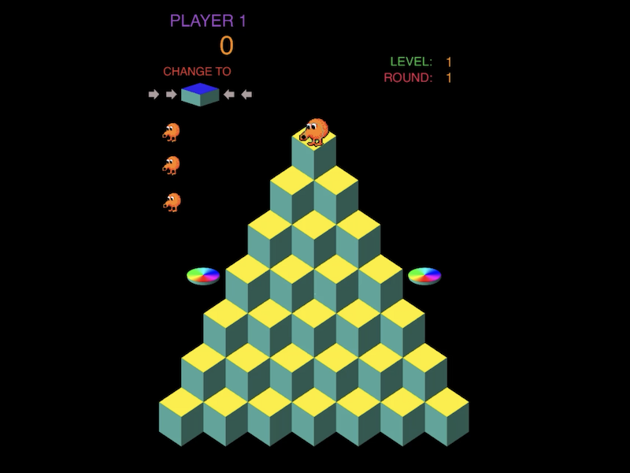

#  RyBert

## A SpriteKit game for iOS based

Written in Swift as an experiment with design patterns - specifically using notifications to message separated game components.

## Progress

* Have two types of baddies (blobs and sid), tiles, disks and gamegrid classes - done
* Need to move player to its own class - Done
* No logic for detecting collisions, levels, end of game, score etc. just yet - Mostly done
* Do controls work by tapping relative to player, or fixed to screen quadrants? - relative to qbert. Add arrows that disappear soon to help player - done
* Notification driven system to keep class interactions to the minimum. I like this approach. - done
* Because events are sent even while characters are animating, and so potentially pass through each other, I should implement a sprite collision detection system. - Done
* Sound effects - done
* First flight build - done and shared. Success!
